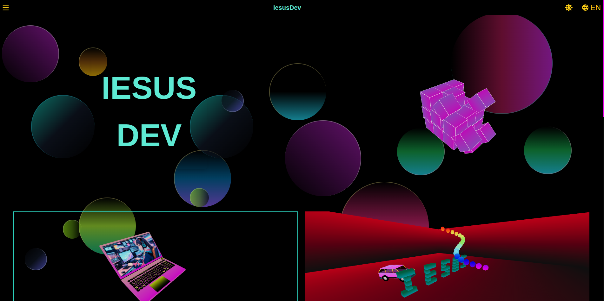

# 🚀 Portafolio Personal con Next.js y Three.js

[](https://nextjs.org/)
[](https://threejs.org/)
[](https://reactjs.org/)



Bienvenido a mi portafolio personal desarrollado con Next.js y Three.js. Este sitio muestra mis proyectos interactivos que combinan programación, matemáticas y gráficos 3D/2D.

## ✨ Demos Interactivas

### 🎮 Juegos
- **Juego de Naves 2D**: Un shooter espacial clásico desarrollado con Canvas API
- **Snake Game**: El clásico juego de la serpiente con controles táctiles
- **Torre de Hanoi**: Implementación interactiva del famoso rompecabezas matemático

### 🧮 Proyectos Matemáticos
- **Calculadora de Números Primos**: Visualización de la distribución de números primos
- **Simulador de Conjetura de Collatz**: Exploración interactiva de esta secuencia matemática

### 🚀 Simulaciones 3D
- **Simulador de Tiro Libre**: Física de proyectiles en un entorno 3D interactivo
- **Otras animaciones Three.js**: Efectos visuales y experiencias inmersivas

## 🛠 Tecnologías Utilizadas
- **Framework**: Next.js (React)
- **Gráficos 3D**: Three.js, R3F (React Three Fiber)
- **Animaciones**: Framer Motion
- **Estilos**: Tailwind CSS
- **Física**: Cannon.js (para simulaciones físicas)

## 🚀 Cómo Ejecutar Localmente

1. Clona el repositorio:
```bash
git clone https://github.com/tu-usuario/tu-repositorio.git
